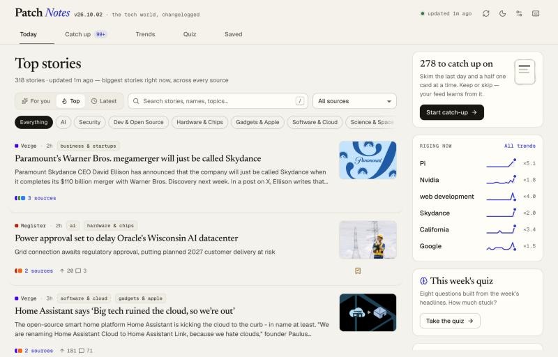
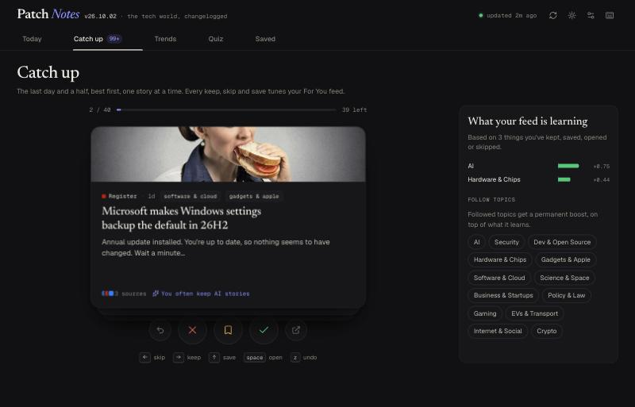
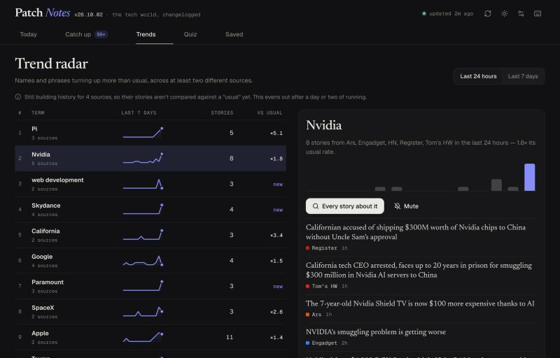

# Patch Notes

Patch notes for the tech world. A personal news dashboard that pulls the day's
tech stories from Hacker News, Lobsters, GitHub and a dozen outlets, groups
coverage of the same story together, learns what you actually care about, spots
the names that are suddenly everywhere, and quizzes you on what stuck.

Everything is read-only against free, keyless sources — no accounts, no API
keys, no tracking. Your reading history lives in a local SQLite file.



## Features

- **Today** — one feed across 14 sources, with three rankings:
  - **For you**, which learns from every keep, save, open, skip and "not
    interested" and tells you *why* a story is there ("You often keep Security
    stories", "Mentions Nvidia, which you've liked before").
  - **Top**, a quality × freshness score where popularity is judged *within*
    each source (300 points on HN and 40 on Lobsters are both a big deal) and
    every extra outlet covering a story counts for a lot.
  - **Latest**, grouped by day, with a "you were last here" marker.

  Topic filters, source filter, full-text search over everything stored, and
  keyboard navigation (`j`/`k`, `o`, `s`, `x`, `e`, `c`, `/`).
- **Story clusters** — when Ars, The Register and Tom's Hardware all write up the
  same Micron earnings call, it's one card with "3 sources". Expand it to compare
  how each outlet headlined it and who got there first. HN and Lobsters threads
  open inline with their top comments.
- **Catch up** — the last day and a half as a card deck. Swipe (or press `→`/`←`/`↑`)
  to keep, skip or save; flicks carry their momentum, `z` undoes. A side panel shows
  the For You profile shifting as you go, and you can follow topics from it.
- **Trend radar** — names and phrases appearing in more stories than usual, across
  at least two different sources, with sparklines, a ×-vs-usual ratio, and the
  stories behind each one. Topic small multiples show which areas are getting
  louder. Click through to search, or mute a term you're sick of.
- **Headline quiz** — eight questions generated from the week's stories: fill in
  the missing company or number, guess which outlet wrote a headline, which story
  got the most HN points, which one the most outlets covered. Stories you read come
  up more often. Scores are kept so you can see a streak.
- **Saved** — a reading list that outlives the 30-day story retention, filterable,
  and exportable as Markdown links.
- Light and dark themes, phone layout, `?` for every shortcut, `g` + letter to jump
  between sections, and motion that respects `prefers-reduced-motion`.





## Architecture

```
backend/   Python · FastAPI · SQLite · APScheduler
  app/sources.py     the 14 sources (HN via Algolia, Lobsters JSON, GitHub search, RSS/Atom)
  app/fetchers.py    one parser per source kind → a common story shape; conditional GETs for feeds
  app/ingest.py      fetch cycle every 10 min: normalise, tag, store, re-cluster, prune
  app/topics.py      rule-based topic tagging (13 topics), explainable by design
  app/clustering.py  TF-IDF headline similarity with name boosting, centroid clustering
  app/ranking.py     Top / Latest / For You, profile learning, "why this" reasons
  app/trends.py      rising terms and topic volumes against a per-source baseline
  app/quiz.py        seeded quiz generation from the week's headlines
  app/feed.py        assembles ranked, annotated clusters for each view
  app/main.py        REST API

frontend/  React · TypeScript · Vite
  src/views/         Today, Catch up, Trends, Quiz, Saved
  src/components/    story card, swipe deck, charts, dialogs
  src/spring.ts      spring physics baked into CSS linear() easings for WAAPI
```

A few decisions worth knowing about:

- **Clustering** compares headlines as TF-IDF vectors, with words that look like
  names (capitalised mid-sentence in sentence-case headlines, or shaped like
  `iPhone`/`M5`) counting double — so two "critical flaw exploited" stories about
  *different* products stay apart while differently-worded coverage of the same
  one joins up. Stories join the cluster whose *centroid* they match, which avoids
  the chaining you get from single-link clustering; an outlet's recurring series
  ("9to5Mac Daily: …") never clusters with itself.
- **Trends** need a baseline, and RSS feeds only carry their last few dozen items,
  so a brand-new install has no history for most outlets. Rather than comparing
  fresh stories against an empty past (which makes everything look like it's
  exploding), each source only joins the comparison once its stored history covers
  enough of the baseline period. Single words only count if they look like names,
  so "data" and "adds" never trend.
- **For You** is a transparent average, not a black box: each interaction votes
  for or against the story's topics, source and headline terms, smoothed so one
  skip doesn't bury a topic. Reasons are only shown once there are a few signals
  behind them.
- **Motion** is purposeful and cheap: transforms and opacity only, strong
  ease-out curves, the swipe deck runs on pointer events and the Web Animations
  API with spring easings generated in `spring.ts` (no animation library), and
  keyboard-triggered actions stay fast.

## Setup

### Backend

```bash
cd backend
python3 -m venv .venv
source .venv/bin/activate
pip install -r requirements.txt
uvicorn app.main:app --reload
```

Runs on `http://localhost:8000`. The first fetch starts immediately and takes a
few seconds; on an empty database it also backfills a week of popular Hacker
News stories so trends and the quiz have something to work with. Copy
`.env.example` to `.env` to change the fetch interval, retention, or add an
optional `GITHUB_TOKEN`.

Tests:

```bash
python -m pytest
```

### Frontend

```bash
cd frontend
npm install
npm run dev
```

Runs on `http://localhost:5173` and proxies `/api` to the backend.

## Notes and next steps

- Topic tagging is keyword-based. It's fast, deterministic and easy to explain,
  but it will mis-tag the odd story; an embedding classifier would do better.
- Clustering errs slightly towards merging. Two stories that share a rare name and
  a phrase ("Cloudflare K2" and a documentary called "Winter K2") can end up
  together.
- Trends get noticeably better after Patch Notes has been running for a couple of
  days, once every outlet has a real baseline.
- Natural extensions: a daily digest email, embeddings for clustering and "more
  like this", reading-time estimates, and an About page explaining the ranking.
